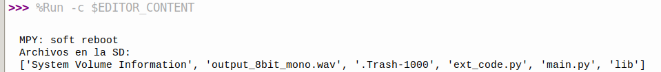
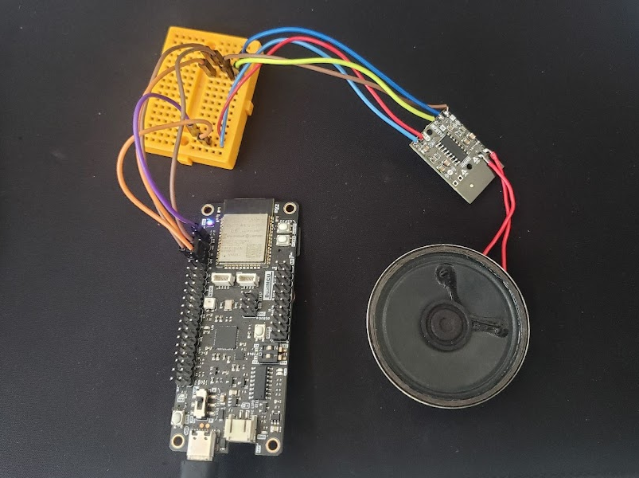

# VoiceAmp_Synth_ESP32

In this repository, a vocal synthesizer is designed using a PAM8403 3W audio amplifier and an ESP32 microcontroller. FFmpeg converts bit rates and formats, while Python generates WAV files. The PAM8403 module amplifies the synthesized voice communications, which are played by the ESP32's DAC. Suitable for embedded audio systems and voice-based systems.

The UNIT PAM8403 Audio Amplifier 3W is a Class D audio amplifier module that generates a 3W stereo output per channel with exceptional efficiency. It is advantageous for battery-powered devices, portable speakers, and music players.

Analog output signals may be generated by either of the two ESP32 DAC channels. Audio files are played, waveforms are generated, and analog circuitry is managed by DAC channels. The output of the ESP32 DAC is 8 bits and spans the range of 0 to 255. The output of a DAC can be enhanced by an external audio amplifier module, such as the PAM8403.

Using Python, the project produces WAV audio files that contain synthetic spoken messages. The script utilizes pyttsx3 to convert text to voice, and FFmpeg to determine the bit rates and formats of audio. The ESP32's DAC output and PAM8403 audio amplifier are capable of playing audio files that have been produced.

## Hardware Required

- DualMCU Development Board (ESP32)
- UNIT_PAM8403_Audio_Amplifier_3W
- Speaker
- USB Cable

## Software Required

- Thonny IDE
- Python 3
- FFmpeg

## Pinout Connections

- ESP32 3V3 -> PAM8403 VCC
- ESP32 GND -> PAM8403 GND
- ESP32 DAC1 -> PAM8403 L
- ESP32 DAC1 -> PAM8403 R

## Installation

1. Clone the repository to your local machine:

   ```bash
   git clone VoiceAmp_Synth_ESP32
   ```

2. Install the required Python libraries:

   ```bash
   pip install pyttsx3
   ```

3. Install FFmpeg:

   - Windows: Download the FFmpeg executable from the official website and add it to your system PATH.
   - Linux: Install FFmpeg using the package manager of your distribution.

## Usage

1. Run the Python script to generate a WAV audio file with a synthesized voice message:

   ```python
   synthesize_voice("Hello World test 1 2 3 4 5 6", "file.wav")
   ```

2. Convert the audio file to the required format and bit rate using FFmpeg:

   ```bash
   ffmpeg -i file.wav -ac 1 -ar 8000 -c:a pcm_u8 output_8bit_mono.wav
   ```
Example successful output:

  ```bash
  ffmpeg -i file.wav -ac 1 -ar 8000 -c:a pcm_u8 output_8bit_mono.wav
  ffmpeg version 6.1.1-3ubuntu5 Copyright (c) 2000-2023 the FFmpeg developers
    built with gcc 13 (Ubuntu 13.2.0-23ubuntu3)
    configuration: --prefix=/usr --extra-version=3ubuntu5 --toolchain=hardened --libdir=/usr/lib/x86_64-linux-gnu --incdir=/usr/include/x86_64-linux-gnu --arch=amd64 --enable-gpl --disable-stripping --disable-omx --enable-gnutls --enable-libaom --enable-libass --enable-libbs2b --enable-libcaca --enable-libcdio --enable-libcodec2 --enable-libdav1d --enable-libflite --enable-libfontconfig --enable-libfreetype --enable-libfribidi --enable-libglslang --enable-libgme --enable-libgsm --enable-libharfbuzz --enable-libmp3lame --enable-libmysofa --enable-libopenjpeg --enable-libopenmpt --enable-libopus --enable-librubberband --enable-libshine --enable-libsnappy --enable-libsoxr --enable-libspeex --enable-libtheora --enable-libtwolame --enable-libvidstab --enable-libvorbis --enable-libvpx --enable-libwebp --enable-libx265 --enable-libxml2 --enable-libxvid --enable-libzimg --enable-openal --enable-opencl --enable-opengl --disable-sndio --enable-libvpl --disable-libmfx --enable-libdc1394 --enable-libdrm --enable-libiec61883 --enable-chromaprint --enable-frei0r --enable-ladspa --enable-libbluray --enable-libjack --enable-libpulse --enable-librabbitmq --enable-librist --enable-libsrt --enable-libssh --enable-libsvtav1 --enable-libx264 --enable-libzmq --enable-libzvbi --enable-lv2 --enable-sdl2 --enable-libplacebo --enable-librav1e --enable-pocketsphinx --enable-librsvg --enable-libjxl --enable-shared
    libavutil      58. 29.100 / 58. 29.100
    libavcodec     60. 31.102 / 60. 31.102
    libavformat    60. 16.100 / 60. 16.100
    libavdevice    60.  3.100 / 60.  3.100
    libavfilter     9. 12.100 /  9. 12.100
    libswscale      7.  5.100 /  7.  5.100
    libswresample   4. 12.100 /  4. 12.100
    libpostproc    57.  3.100 / 57.  3.100
  [aist#0:0/pcm_s16le @ 0x61e9f04117c0] Guessed Channel Layout: mono
  Input #0, wav, from 'file.wav':
    Metadata:
      encoder         : Lavf60.16.100
    Duration: 00:00:03.00, bitrate: 353 kb/s
    Stream #0:0: Audio: pcm_s16le ([1][0][0][0] / 0x0001), 22050 Hz, 1 channels, s16, 352 kb/s
  Stream mapping:
    Stream #0:0 -> #0:0 (pcm_s16le (native) -> pcm_u8 (native))
  Press [q] to stop, [?] for help
  Output #0, wav, to 'output_8bit_mono.wav':
    Metadata:
      ISFT            : Lavf60.16.100
    Stream #0:0: Audio: pcm_u8 ([1][0][0][0] / 0x0001), 8000 Hz, mono, u8, 64 kb/s
      Metadata:
        encoder         : Lavc60.31.102 pcm_u8
  [out#0/wav @ 0x61e9f0420c80] video:0kB audio:23kB subtitle:0kB other streams:0kB global headers:0kB muxing overhead: 0.325000%
  size=      24kB time=00:00:02.99 bitrate=  64.3kbits/s speed= 715x    
  ```
3. Copy the audio file using an SD card.

4. Connect the ESP32 to the PAM8403 audio amplifier and speaker.

5. Upload the following code to the ESP32 using Thonny IDE:

   ```python
   from machine import DAC, Pin, SPI
   import os
   from dualmcu import sdcard
   import time

   spi = SPI(2, baudrate=1000000, polarity=0, phase=0, sck=Pin(18), mosi=Pin(23), miso=Pin(19))
   cs = Pin(5, Pin.OUT)
   sd = sdcard.SDCard(spi, cs)
   os.mount(sd, '/sd')

   print("Archivos en la SD:")
   print(os.listdir('/sd'))

   def play_wav(filename, volume=1.0):
       dac = DAC(Pin(25))
       try:
           with open(filename, 'rb') as f:
               f.seek(44)  # Skip the WAV header
               while True:
                   data = f.read(1024)
                   if not data:
                       break
                   for byte in data:
                       adjusted_value = int(min(max(byte * volume, 0), 255))
                       dac.write(adjusted_value)
                       time.sleep_us(125)
       except OSError as e:
           print("Error opening the file:", e)

   play_wav('/sd/output_8bit_mono.wav', volume=0.9)
   ```

<div style="text-align: center;">
  
</div>

## Connections Image

<div style="text-align: center;">
  
</div>

## License

This project is licensed under the MIT License - see the LICENSE file for details.


## Additional Information

- For more information about the ESP32, visit the [ESP32 Documentation](https://docs.espressif.com/projects/esp-idf/en/latest/esp32/index.html).
- [DualMCU](https://github.com/UNIT-Electronics/DualMCU).
- [DualMCU_Curso_introductorio](https://unit-electronics.github.io/DualMCU_Curso_introductorio/).